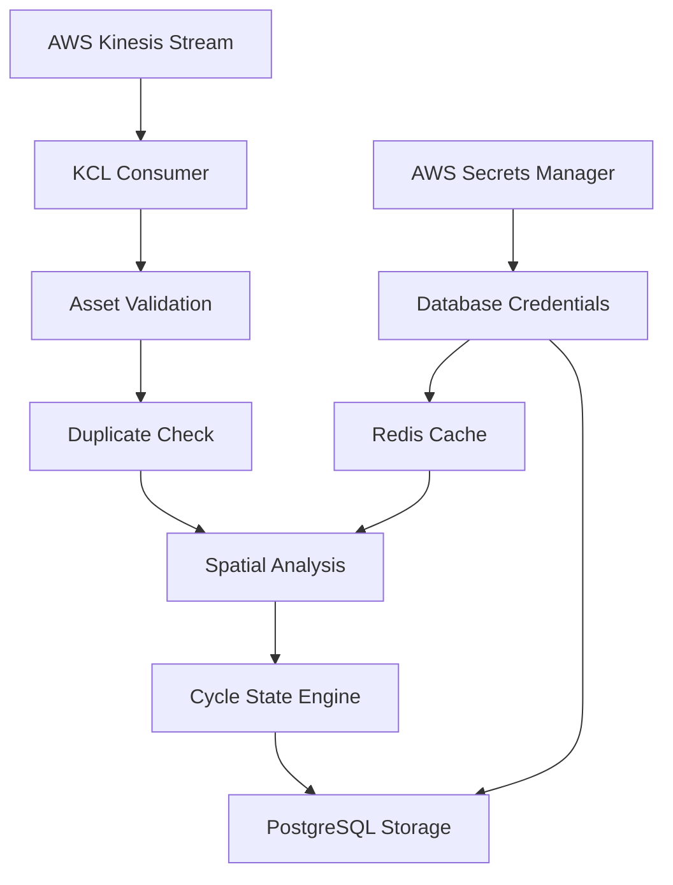

# Mining Asset Cycle Tracking Service

A real-time data processing pipeline for tracking operational cycles of mining haul trucks. This service consumes telemetry data from AWS Kinesis, enriches it with contextual information, and tracks complete operational cycles from loading through dumping and back.

## Business Logic & Process Flow

### Mining Operations Context

In mining operations, haul trucks follow repetitive operational cycles:

1. **Loading Phase** - Truck is positioned at a loader and loaded with material
2. **Loaded Travel** - Truck travels to a designated dump region with material
3. **Dumping Phase** - Truck dumps material at the dump site
4. **Empty Travel** - Truck returns empty to the loader for the next cycle

### AWS Kinesis Data Stream - Primary Data Source

#### **Business Context**
Mining operations generate massive volumes of real-time telemetry data from hundreds of vehicles operating 24/7 across multiple mine sites. Traditional batch processing cannot support:

- **Real-time Fleet Monitoring**: Operations teams need live truck status and location
- **Immediate Safety Response**: Rapid detection of equipment in unauthorized areas
- **Dynamic Dispatch Optimization**: Real-time routing based on current conditions
- **Operational Efficiency**: Live cycle time tracking and productivity metrics

#### **Kinesis Stream Configuration**
The service consumes from AWS Kinesis Data Stream with specific configuration:

**Stream Properties** (configured in `config/kcl-config-realtime.properties`):
```properties
# Stream identification
streamName = tx-asset-cycle-vlx-stream
regionName = us-east-1

# Consumer application identity
applicationName = tx_asset_cycle_realtime

# Processing behavior
initialPositionInStream = LATEST
maxRecords = 100
idleTimeBetweenReadsInMillis = 1000

# Monitoring and logging
metricsLevel = DETAILED
logLevel = ERROR

# Shard management
cleanupLeasesUponShardCompletion = true
AwsCredentialsProvider = DefaultCredentialsProvider
```

**KCL (Kinesis Consumer Library) Configuration**:

- **Consumer Group**: `tx_asset_cycle_realtime` (enables horizontal scaling)
- **Starting Position**: `LATEST` (process only new data, not historical backlog)
- **Batch Size**: 100 records per processing batch
- **Polling Frequency**: 1 second between reads when no data available

#### **Data Stream Format and Structure**

**Partition Key Strategy**:
```
Partition Key: {asset_guid}
Purpose: Ensures all records for a truck go to same shard for ordered processing
Example: "truck-HAU-001-SITE-456"
```

**Message Format** (JSON structure in Kinesis record):
```json
{
  "asset_guid": "truck-HAU-001-SITE-456",
  "site_guid": "SITE-456-NORTH-PIT",
  "timestamp": "2024-01-15T14:30:25.123Z",
  "latitude": -23.7749123,
  "longitude": 133.4194567,
  "work_state_id": 3
}
```

**Field Specifications**:

| Field | Type | Business Purpose | Validation |
|-------|------|------------------|------------|
| `asset_guid` | String | Unique truck identifier | Required |
| `site_guid` | String | Mining site location | Required, must exist in asset database |
| `timestamp` | ISO 8601 | UTC timestamp of telemetry | Required, chronological order expected |
| `latitude` | Float | GPS latitude coordinate | Required, range: -90 to 90 |
| `longitude` | Float | GPS longitude coordinate | Required, range: -180 to 180 |
| `work_state_id` | Integer | Equipment operational state | Required, 2=IDLING, 3=WORKING |

#### **Message Volume and Characteristics**

**Typical Data Volumes**:

- **Frequency**: Every 10-30 seconds per truck
- **Fleet Size**: 50-200 trucks per mine site
- **Daily Volume**: ~500K-2M messages per site
- **Message Size**: ~200-500 bytes per record
- **Peak Throughput**: 100-500 messages/second per site

**Data Quality Characteristics**:

- **Out-of-Order**: Network delays can cause temporal disorder
- **Duplicates**: Telematics systems may resend data
- **Missing Records**: Connectivity issues in remote mine locations
- **Latency Variance**: 1-60 seconds from truck to stream

#### **Stream Partitioning Strategy**

**Business Rationale for Asset-Based Partitioning**:

1. **Ordered Processing**: All records for a truck processed sequentially
2. **State Consistency**: Cycle state maintained correctly per asset
3. **Horizontal Scaling**: Different trucks can be processed in parallel
4. **Shard Distribution**: Even workload across Kinesis shards

**Partition Distribution Example**:
```
Shard 1: truck-001, truck-004, truck-007, truck-010...
Shard 2: truck-002, truck-005, truck-008, truck-011...
Shard 3: truck-003, truck-006, truck-009, truck-012...
```

#### **Consumer Library (KCL) Integration**

**MultiLangDaemon Architecture**:
```
Java KCL Daemon ←→ Python Application
     ↓                    ↓
Kinesis Shards      Business Logic
     ↓                    ↓
Checkpointing      Database Writes
```

**Shard Assignment and Scaling**:

- **Dynamic Balancing**: KCL automatically distributes shards among consumers
- **Automatic Failover**: Failed consumers trigger shard redistribution
- **Elastic Scaling**: Add/remove ECS tasks to handle load changes
- **Checkpoint Management**: Automatic progress tracking and recovery

**Error Handling and Resilience**:
```python
# Built-in retry logic in RecordProcessor
try:
    process_record(data)
except Exception as e:
    logger.error(f"Processing failed: {e}")
    # Record logged but processing continues
    # Shard continues with next record
    # No data loss - record remains in stream
```

#### **Configuration Files Detail**

**Primary Configuration** (`config/kcl-config-realtime.properties`):
```properties
# Python application entry point
executableName = /usr/src/app/main.py

# Stream and application identity
streamName = tx-asset-cycle-vlx-stream
applicationName = tx_asset_cycle_realtime
regionName = us-east-1

# Processing configuration
initialPositionInStream = LATEST      # Start from newest data
maxRecords = 100                      # Batch size for processing
idleTimeBetweenReadsInMillis = 1000   # Polling frequency when idle

# Monitoring and observability
metricsLevel = DETAILED               # CloudWatch metrics detail level
logLevel = ERROR                      # Java daemon log level

# Shard lifecycle management
cleanupLeasesUponShardCompletion = true
AwsCredentialsProvider = DefaultCredentialsProvider
```

**Logging Configuration** (`config/logback.xml`):
```xml
<configuration>
  <appender name="STDOUT" class="ch.qos.logback.core.ConsoleAppender">
    <encoder>
      <pattern>%d{yyyy-MM-dd HH:mm:ss} [%thread] %-5level %logger{36} - %msg%n</pattern>
    </encoder>
  </appender>
  <root level="ERROR">
    <appender-ref ref="STDOUT" />
  </root>
</configuration>
```

**Why These Settings**:

- **LATEST Position**: Avoid processing historical backlog on startup
- **100 Record Batches**: Balance between throughput and memory usage
- **ERROR Level Logging**: Reduce noise in production logs
- **1 Second Polling**: Balance between latency and resource usage

#### **Alternative Processing Modes**

The service supports different processing modes via `TX_TYPE` environment variable:

**Realtime Mode** (`TX_TYPE=realtime`):

- **Purpose**: Live operational monitoring
- **Configuration**: `kcl-config-realtime.properties`
- **Starting Position**: LATEST (current data only)
- **Use Case**: Active fleet monitoring and cycle tracking

**Reprocess Mode** (`TX_TYPE=reprocess`):

- **Purpose**: Historical data backfill or recovery
- **Configuration**: `kcl-config-reprocess.properties` (not currently implemented)
- **Starting Position**: TRIM_HORIZON (from beginning)
- **Use Case**: Data recovery after system outages
- **Note**: Reprocess configuration file needs to be created if this mode is required

### Real-Time Processing Pipeline



#### Data Flow Process

1. **Stream Consumption**: Consumes real-time telemetry from Kinesis Data Stream
2. **Asset Validation**: Verifies asset is a trackable haul truck
3. **Temporal Validation**: Prevents reprocessing of older data
4. **Data Enrichment**: Enhances raw telemetry with contextual business data:
    - **PostgreSQL Reads**: Asset metadata and loader positioning
    - **Redis Reads**: Geospatial region definitions
5. **Spatial Context**: Determines truck location relative to:
    - Loading areas (proximity to loader assets)
    - Dump regions (within geofenced areas)
    - Travel segments (between operational areas)
6. **Cycle State Management**: Processes state transitions and calculates:
    - Loading duration
    - Travel times (loaded and empty)
    - Dumping duration
    - Total cycle time
7. **Data Persistence**: Stores cycle records and process checkpoints

### Data Sources and Enrichment - Business Context

#### **Raw Telemetry Data (Kinesis Input)**
**Source**: GPS/Telematics devices on haul trucks

**Content**: Basic position and status data
```json
{
  "asset_guid": "truck-123",
  "site_guid": "site-456",
  "timestamp": "2024-01-01T10:30:00Z",
  "latitude": 37.7749,
  "longitude": -122.4194,
  "work_state_id": 3  // 2=IDLING, 3=WORKING
}
```

**Business Limitation**: Raw telemetry alone cannot determine:

- What type of equipment this is (truck vs. other machinery)
- Where the operational areas are located
- Which loader the truck should work with
- Whether the truck is in an authorized dump zone

#### **PostgreSQL Data Sources - Asset Intelligence**

**1. Asset Type Validation (`dx.asset` table)**

**Business Need**: Filter only haul trucks from all mining equipment

**Why Essential**:

- Mining sites have many equipment types (excavators, dozers, water trucks, etc.)
- Only haul trucks follow the load→travel→dump→return cycle pattern
- Prevents processing non-relevant equipment telemetry

**2. Last Cycle State (`dx.asset_cycle_tmp_vlx` table)**

**Business Need**: Continue tracking existing operational cycles

**Why Essential**:

- Trucks operate in continuous cycles over 8-12 hour shifts
- Each telemetry point is part of an ongoing cycle story
- Need previous state to determine current cycle phase progression

**3. Loader Asset Positioning (`dx.asset` + `dx.asset_info` tables)**

**Business Need**: Determine if truck is near a loader for cycle initiation

**Why Essential**:

- Loading can only occur near operational loaders
- Distance calculation determines if truck is positioned for loading
- Different loaders may have different cycle patterns or assignments

**4. Processing Checkpoints (`dx.tx_process_info` table)**

**Business Need**: Prevent duplicate processing and ensure data continuity

**Why Essential**:

- Telemetry systems can send duplicate or out-of-order data
- Service restarts must resume from correct position
- Financial accuracy requires exactly-once processing

#### **Redis Data Sources - Geospatial Intelligence**

**1. Dump Region Definitions (`site:{site_guid}:regions` hash)**

**Business Need**: Determine if truck is within authorized dump zones
```python
# Retrieves: What are the boundaries of all dump regions?
regions = redis_dao.get_site_regions(site_guid, "dump")
# Returns: List of polygon coordinates defining dump boundaries
```

**Typical Redis Structure**:
```json
{
  "region_guid": "dump-001",
  "region_name": "North Pit Dump Zone",
  "region_points": "-122.4 37.7, -122.35 37.75, -122.3 37.7",
  "region_type": "dump"
}
```

**Why Redis for Geospatial Data**:

- **Performance**: Sub-millisecond lookup for real-time geofencing
- **Caching**: Avoids repeated database queries for static region data
- **Scalability**: Handles thousands of position checks per second
- **Data Structure**: Hash maps optimized for key-value region lookups

**Business Impact of Geospatial Enrichment**:

1. **Authorized Dumping**: Ensures trucks dump only in permitted areas
2. **Environmental Compliance**: Prevents dumping in restricted zones
3. **Operational Efficiency**: Identifies optimal dump site utilization
4. **Cycle Validation**: Distinguishes between authorized dumps vs. spillage

### Data Enrichment Business Value

**Before Enrichment** (Raw Telemetry):
```
Truck-123 at coordinates (37.7749, -122.4194) is IDLING at 10:30:00
```

**After Enrichment** (Business Context):
```
Haul Truck-123 is IDLING near Loader-456 (15.2m away) in the North Loading Zone
Current Cycle: #47 (LOAD_TRAVEL phase, started 10:25:30)
Action: Ready to begin dumping in North Pit Dump Zone
```

**Business Decisions Enabled**:

- **Dispatch Optimization**: Route trucks to optimal loaders
- **Productivity Tracking**: Measure cycle times and efficiency
- **Compliance Monitoring**: Ensure proper dump zone usage
- **Predictive Maintenance**: Identify unusual operational patterns
- **Cost Management**: Track fuel efficiency and equipment utilization

### Cycle Status Types

| Status | Description |
|--------|-------------|
| **INPROGRESS** | Active cycle currently being executed |
| **COMPLETE** | All four segments completed with valid durations |
| **INVALID** | Missing segments or abnormal transitions |
| **OUTLIER** | Cycle terminated due to extended idle time during travel |

### Business Rules

- **Loading Start**: Truck must idle near loader for minimum threshold before loading begins
- **Loading Complete**: Detected when truck transitions from idle to moving state
- **Dumping Start**: Truck must idle in dump region for minimum threshold
- **Outlier Detection**: Extended idle time during travel segments marks cycle as outlier
- **Cycle Closure**: Cycles are closed when trucks return to loading areas

### Dual Table Architecture - Business Rationale

The service uses two identical tables for different business purposes:

#### **Temporary Table (`asset_cycle_tmp_vlx`) - Active Operations**
**Business Purpose**: Real-time operational tracking

- **Contains**: Only active cycles with `INPROGRESS` status
- **Updates**: Frequent (every few seconds) as trucks move and change states
- **Usage**:
    - Operations dashboard showing current truck status
    - Real-time fleet monitoring and dispatching
    - Active cycle performance tracking
- **Performance**: Optimized for high-frequency reads/writes with minimal data volume

#### **Final Table (`asset_cycle_vlx`) - Historical Archive**
**Business Purpose**: Permanent record keeping and analytics

- **Contains**: Completed cycles (`COMPLETE`, `INVALID`, `OUTLIER` status)
- **Updates**: Insert-only when cycles are finalized
- **Usage**:
    - Historical performance analysis and KPI reporting
    - Cycle time analytics and trend analysis
    - Operational efficiency reporting for management
    - Compliance and audit trail requirements
- **Performance**: Optimized for analytical queries and data warehousing

#### **Why Separate Tables?**

1. **Operational Efficiency**:
    - Temporary table stays small (only active cycles) for fast real-time queries
    - Final table grows large but doesn't impact real-time performance

2. **Data Lifecycle Management**:
    - Active cycles need frequent updates (position, timing, status changes)
    - Completed cycles are immutable historical records

3. **Query Performance**:
    - Real-time dashboards query small temporary table
    - Analytics/reporting query large final table with appropriate indexing

4. **Backup and Recovery**:
    - Different backup strategies for operational vs. analytical data
    - Temporary table can be rebuilt from stream replay if needed

### Checkpoint and Duplicate Prevention - Business Rationale

#### **Processing Checkpoint Table (`tx_process_info`)**
**Business Purpose**: Exactly-once data processing guarantee

Mining operations require:

- **Data Accuracy**: No duplicate cycles or missing data points
- **Financial Accuracy**: Cycle counts affect productivity metrics and billing
- **Operational Continuity**: Service restarts shouldn't create data gaps

#### **In-Memory Cache (`checkpoint.LATEST_PROCESS_INFO`)**
**Business Purpose**: Performance optimization for high-frequency validation

**Problem Without Cache**:

- Every incoming record (every few seconds) requires database query
- Database becomes bottleneck for timestamp validation
- Increased latency affects real-time processing

**Solution With Cache**:
```python
# Fast in-memory lookup (microseconds vs milliseconds)
if asset_guid in checkpoint.LATEST_PROCESS_INFO:
    cached_timestamp = checkpoint.LATEST_PROCESS_INFO[asset_guid]
    if current_timestamp <= cached_timestamp:
        return "Already processed"  # Skip duplicate

# Update cache after processing
checkpoint.LATEST_PROCESS_INFO[asset_guid] = current_timestamp
```

**Business Benefits**:

- **Real-time Performance**: Sub-second duplicate detection
- **Cost Efficiency**: Reduced database load and connection usage
- **Scalability**: Handles thousands of trucks without database bottleneck
- **Data Integrity**: Prevents processing old/duplicate telemetry data

#### **Duplicate Scenarios Prevented**:

1. **Stream Replay**: Kinesis resharding or consumer restart
2. **Network Issues**: Delayed/duplicate message delivery
3. **Service Restart**: Container restart with Kinesis position reset
4. **Time Zone Issues**: Telemetry with incorrect timestamps

**Example Duplicate Prevention**:
```
Current Time: 10:30:00
Last Processed: 10:29:45 (cached in memory)
Incoming Record: 10:29:30 (older than last processed)
Action: Skip processing - duplicate/old data
```

## Code Architecture

### High-Level Architecture

```
tx-asset-cycle/
├── main.py                    # KCL entry point
├── processing/                # Data processing pipeline
│   ├── extract_phase.py       # Kinesis record processor
│   ├── transform_realtime_phase.py  # Data enrichment & validation
│   ├── load_realtime_phase.py       # Database persistence
│   ├── preprocess.py          # Utility functions for data processing
│   └── cores/                 # Business logic engine
│       └── segment_decision.py      # Cycle state management
├── models/                    # Data structures and database access
│   ├── dto/                   # Data Transfer Objects
│   ├── dao/                   # Data Access Objects
│   └── query/                 # SQL query builders
├── config/                    # Configuration management
├── utils/                     # Utilities and helpers
└── Dockerfile                 # Container configuration
```

### Key Components

#### 1. KCL Integration (`utils/kclpy_helper.py`)
- Manages AWS Kinesis Consumer Library (KCL) Java daemon
- Handles cross-platform Java classpath configuration
- Monitors memory usage of both Python and Java processes

#### 2. Record Processor (`processing/extract_phase.py`)
- Implements KCL RecordProcessorBase interface
- Manages shard lifecycle and checkpointing
- Routes records through transform → load pipeline

#### 3. Transform Phase (`processing/transform_realtime_phase.py`)
- Parses incoming telemetry data
- Validates asset types and temporal ordering
- Performs spatial analysis for truck positioning
- Orchestrates cycle state decisions

#### 4. Load Phase (`processing/load_realtime_phase.py`)
- Persists processed cycle records to PostgreSQL
- Manages temporary and final table writes
- Updates in-memory checkpoint cache for performance optimization
- Handles transaction management and error recovery
- Routes completed cycles to archive tables based on status

#### 5. Cycle State Engine (`processing/cores/segment_decision.py`)
- Implements state machine for cycle progression
- Handles area-specific logic (loading, dumping, traveling)
- Calculates timing metrics and detects outliers
- Manages cycle closure and new cycle creation

#### 6. Data Access Layer (`models/dao/`)
- **PostgreSQL DAO**: Secure database operations with retry logic
- **Redis DAO**: High-performance caching and lookup operations
- **Base DAOs**: Connection management and error handling

#### 6. Data Models (`models/dto/`)
- **CycleRecord**: Complete cycle tracking with timing metrics
- **RealtimeRecord**: Incoming telemetry data structure
- **RegionPoly**: Geospatial operations for dump regions
- **Asset DTOs**: Truck and loader representations

### Design Patterns

- **Strategy Pattern**: Area-specific handlers (loading, dumping, traveling)
- **Factory Pattern**: Record creation with different initialization parameters
- **DAO Pattern**: Abstracted database access with connection pooling
- **Command Pattern**: SQL query composition for safe parameterization

## Prerequisites

### Infrastructure Requirements

- **AWS Account** with appropriate IAM permissions
- **AWS Kinesis Data Stream** for telemetry ingestion
- **PostgreSQL Database** (AWS RDS recommended)
- **Redis Cache** (AWS ElastiCache recommended)
- **AWS Secrets Manager** for credential storage
- **Container Runtime** (Docker/ECS)

### Development Environment

- **Python 3.12+**
- **Poetry** for dependency management
- **Docker** for containerization
- **Java 17** (Amazon Corretto) for KCL daemon
- **Git** for version control

### Database Setup

#### PostgreSQL Tables

The service uses multiple tables for different purposes:

**1. Temporary Processing Table (`dx.asset_cycle_tmp_vlx`)**

- **Purpose**: Active cycle tracking during real-time processing
- **Lifecycle**: Records are INSERT/UPDATE during cycle progression
- **Content**: In-progress cycles with status 'INPROGRESS'

**2. Final Archive Table (`dx.asset_cycle_vlx`)**

- **Purpose**: Permanent storage for completed cycles
- **Lifecycle**: Records copied from temporary table when cycle reaches final status
- **Content**: Cycles with status 'COMPLETE', 'INVALID', or 'OUTLIER'
- **Structure**: Identical to temporary table (same columns)

**Data Flow Between Tables:**
```
Temporary Table (INPROGRESS) → Final Table (COMPLETE/INVALID/OUTLIER)
```

**3. Processing Checkpoint Table (`dx.tx_process_info`)**

- **Purpose**: Exactly-once processing guarantees and recovery
- **Function**: Tracks last processed timestamp per asset
- **Usage**: Prevents reprocessing of duplicate/old data

**4. Asset Master Data (`dx.asset`)**

- **Purpose**: Asset type validation and metadata
- **Usage**: Verify asset is a trackable haul truck

**5. Asset Information Table (`dx.asset_info`)**

- **Purpose**: Loader asset positioning data
- **Usage**: Spatial proximity calculations

### Load Phase Data Flow

The Load Phase (`processing/load_realtime_phase.py`) manages all database writes with the following logic:

```python
# 1. Initial Record Creation
if initial_cycle_record:
    INSERT INTO dx.asset_cycle_tmp_vlx

# 2. Cycle Updates
if last_cycle_record_updated:
    UPDATE dx.asset_cycle_tmp_vlx

    # Archive completed cycles
    if cycle_status IN ('COMPLETE', 'INVALID', 'OUTLIER'):
        INSERT INTO dx.asset_cycle_vlx

# 3. New Cycle Creation
if new_cycle_record:
    INSERT INTO dx.asset_cycle_tmp_vlx

# 4. Checkpoint Management
if process_info_record:
    if is_new_record():
        INSERT INTO dx.tx_process_info
    else:
        UPDATE dx.tx_process_info

    # Update in-memory cache for performance
    LATEST_PROCESS_INFO[asset_guid] = process_date
```

#### Redis Data Structure
```
# Site regions (dump zones, load zones)
site:{site_guid}:regions -> Hash
  - Key: region_name
  - Value: JSON with region_guid, points, region_type
```

## Local Development Setup

### 1. Clone Repository
```bash
git clone <repository-url>
cd tx-asset-cycle
```

### 2. Install Dependencies
```bash
# Install Poetry (if not already installed)
curl -sSL https://install.python-poetry.org | python3 -

# Install project dependencies
# Note: Project uses basic dependency configuration without dev dependencies
poetry install

# Alternative: Install dependencies directly with pip
pip install boto3==1.38.18 psycopg2-binary==2.9.10 shapely==2.1.1 redis==6.2.0 amazon-kclpy==3.0.1 psutil==7.0.0
```

### 3. Set Up Environment Variables
```bash
# Create environment file with required variables
export TX_TYPE=realtime
export AWS_REGION=us-east-1
export PGSQL_CREDENTIALS_SECRET_NAME=your-postgres-secret
export REDIS_CREDENTIALS_SECRET_NAME=your-redis-secret
export KINESIS_STREAM_NAME=your-stream-name

# Or create a .env file for persistent configuration
cat > .env << EOF
TX_TYPE=realtime
AWS_REGION=us-east-1
PGSQL_CREDENTIALS_SECRET_NAME=your-postgres-secret
REDIS_CREDENTIALS_SECRET_NAME=your-redis-secret
KINESIS_STREAM_NAME=your-stream-name
EOF
```

### 4. Configure AWS Credentials
```bash
# Option 1: AWS CLI
aws configure

# Option 2: Environment variables
export AWS_ACCESS_KEY_ID=your_access_key
export AWS_SECRET_ACCESS_KEY=your_secret_key
export AWS_SESSION_TOKEN=your_session_token  # If using temporary credentials
```

### 5. Set Up Database Secrets
Create secrets in AWS Secrets Manager with the following structure:

**PostgreSQL Secret** (name: `your-postgres-secret`):
```json
{
  "host": "your-postgres-host",
  "port": "5432",
  "dbname": "your-database",
  "username": "your-username",
  "password": "your-password"
}
```

**Redis Secret** (name: `your-redis-secret`):
```json
{
  "host": "your-redis-host",
  "port": "6379",
  "username": "your-username",
  "password": "your-password"
}
```

### 6. Run Health Check
```bash
poetry run python utils/healthcheck.py
```

### 7. Start Local Development
```bash
# Set environment variables
export TX_TYPE=realtime
export KINESIS_STREAM_NAME=your-stream-name
export AWS_REGION=us-east-1
export PGSQL_CREDENTIALS_SECRET_NAME=your-postgres-secret
export REDIS_CREDENTIALS_SECRET_NAME=your-redis-secret

# Run the service
poetry run python utils/kclpy_helper.py
```

## Environment Variables

### Required Variables

| Variable | Description | Example |
|----------|-------------|---------|
| `TX_TYPE` | Processing mode (`realtime` or `reprocess`) | `realtime` |
| `AWS_REGION` | AWS region for all services | `us-east-1` |
| `PGSQL_CREDENTIALS_SECRET_NAME` | PostgreSQL secret name | `mining-db-prod` |
| `REDIS_CREDENTIALS_SECRET_NAME` | Redis secret name | `mining-cache-prod` |
| `KINESIS_STREAM_NAME` | Kinesis stream name (for logging/monitoring) | `tx-asset-cycle-vlx-stream` |

### AWS Authentication (Choose One)

#### Option 1: IAM Role (Recommended for ECS)
- No additional environment variables needed
- Attach IAM role to ECS task

#### Option 2: Access Keys
| Variable | Description |
|----------|-------------|
| `AWS_ACCESS_KEY_ID` | AWS access key |
| `AWS_SECRET_ACCESS_KEY` | AWS secret key |
| `AWS_SESSION_TOKEN` | Session token (temporary credentials) |

### Optional Variables

| Variable | Description | Default |
|----------|-------------|---------|
| `JAVA_OPTS` | JVM tuning parameters for KCL daemon | `-Xms512m -Xmx768m -XX:+UseG1GC` |
| `KINESIS_STREAM_NAME` | Stream name (used for logging/monitoring) | `unknown` |

### Business Logic Configuration

These are configured in `config/static_config.py`:

| Configuration | Description | Default |
|---------------|-------------|---------|
| `IDLE_THRESHOLD_FOR_START_LOAD` | Minimum idle time before loading starts | 20.0 seconds |
| `IDLE_THRESHOLD_FOR_START_DUMP` | Minimum idle time before dumping starts | 20.0 seconds |
| `IDLE_THRESHOLD_IN_TRAVEL_SEGMENT` | Maximum idle time before marking as outlier | 600.0 seconds |
| `DISTANCE_THRESHOLD_FOR_LOADER` | Maximum distance to consider truck near loader | 50.0 meters |

## Container Deployment

### Build Docker Image
```bash
docker build -t tx-asset-cycle .
```

### Run Container
```bash
docker run -d \
  --name tx-asset-cycle \
  -e TX_TYPE=realtime \
  -e AWS_REGION=us-east-1 \
  -e PGSQL_CREDENTIALS_SECRET_NAME=your-postgres-secret \
  -e REDIS_CREDENTIALS_SECRET_NAME=your-redis-secret \
  -e AWS_ACCESS_KEY_ID=your_access_key \
  -e AWS_SECRET_ACCESS_KEY=your_secret_key \
  tx-asset-cycle
```

## Monitoring & Troubleshooting

### Health Checks
```bash
# Check service health
curl -f http://localhost/health || exit 1

# Manual health check
python3 utils/healthcheck.py
```

### Key Metrics to Monitor
- **Processing Latency**: Time from Kinesis ingestion to database persistence
- **Cycle Completion Rate**: Percentage of cycles marked as COMPLETE vs INVALID/OUTLIER
- **Memory Usage**: Both Python consumer and Java KCL daemon
- **Database Connection Pool**: Active connections and wait times
- **Kinesis Shard Progress**: Iterator age and processing lag

### Common Issues

1. **OutOfMemoryError in Java KCL**
   - Increase `JAVA_OPTS` memory settings
   - Monitor shard count and adjust memory accordingly

2. **Database Connection Timeouts**
   - Check network connectivity to RDS
   - Verify security group rules
   - Review connection pool settings

3. **Redis Connection Failures**
   - Verify Redis cluster health
   - Check SSL/TLS configuration
   - Review timeout settings

4. **Processing Lag**
   - Scale ECS service horizontally
   - Increase Kinesis shard count
   - Optimize database queries

### Logging
The service provides structured JSON logging for:

- Processing progress and timing
- Error conditions with stack traces
- Business logic decisions
- Database operations
- Memory usage monitoring

## Contributing

1. **Code Style**: Follow PEP 8 with line length of 88 characters
2. **Type Hints**: Use comprehensive type annotations
3. **Documentation**: Add docstrings to all public methods
4. **Testing**: Write unit tests for new functionality
5. **Error Handling**: Include proper exception handling and logging

## License

This software is proprietary to Vizalogix Pte Ltd and is intended for internal use
only. All rights reserved. No part of this software may be reproduced, distributed,
or transmitted in any form or by any means without the prior written permission of
Vizalogix Pte Ltd.

Copyright © 2025 Vizalogix Pte Ltd. All rights reserved.